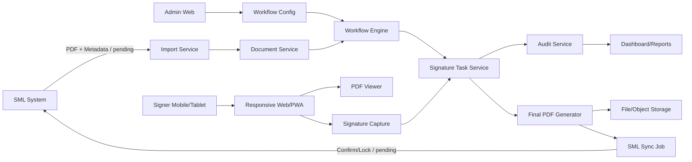
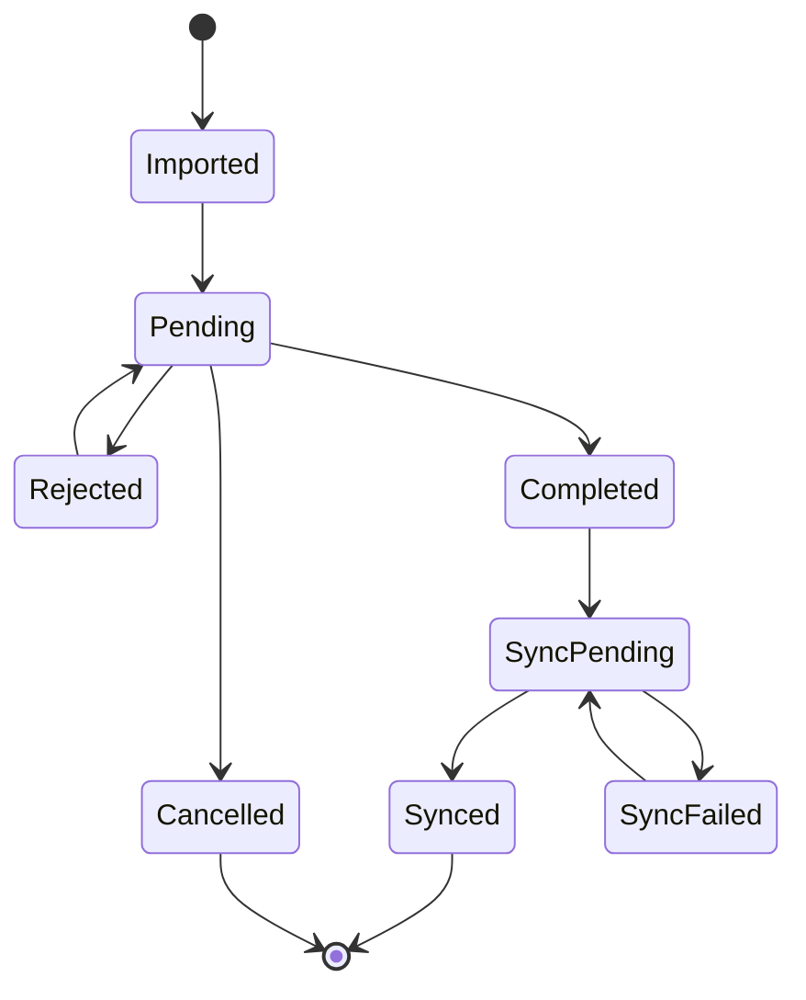

# Blueprint ระบบ PaperLess / E-Signature เชื่อม SML

## 1. ภาพรวมระบบ

ระบบ PaperLess / E-Signature นี้เป็น Web Application สำหรับรับเอกสารจาก SML ในรูปแบบ PDF พร้อมข้อมูลเอกสาร จากนั้นนำเอกสารเข้าสู่ workflow ลงลายมือชื่ออิเล็กทรอนิกส์ตาม `doc_format_code` เช่น POP, INV โดยระบบต้องรองรับการเซ็นบน mobile/tablet เป็นหลัก เก็บ audit trail ครบถ้วน สร้าง final PDF และเตรียมส่งสถานะกลับไปที่ SML เมื่อทีม SML ยืนยันวิธีเชื่อมต่อ

เป้าหมายคือทำระบบที่ใช้งานจริงได้ ไม่ใช่แค่ upload PDF แล้ววาดลายเซ็น แต่ต้องควบคุมลำดับ อำนาจผู้เซ็น เงื่อนไขความสมบูรณ์ เอกสารแนบ ประวัติการทำรายการ และป้องกันความผิดพลาดจากผู้ใช้

## 2. Scope

### 2.1 In Scope

- รับเอกสาร PDF เข้าระบบ
- เก็บข้อมูลเอกสาร เช่น doc no, doc format code, วันที่, มูลค่า, เอกสารต้นทาง
- ตั้งค่า workflow ตาม `doc_format_code`
- ตั้งค่าผู้ลงนามตาม position, user, ลำดับ และเงื่อนไข
- สร้าง task ลงนามให้ผู้เกี่ยวข้อง
- Inbox สำหรับผู้ใช้แต่ละคน
- เปิดดู PDF และเอกสารแนบ
- ลงลายมือชื่อบน mobile/tablet ด้วยนิ้ว
- รองรับ mouse/stylus เป็นทางเลือก
- Confirm / Reject เอกสาร
- เก็บ audit log
- สร้าง final PDF พร้อมลายเซ็นและข้อความทางกฎหมาย
- Dashboard / รายงานสถานะเอกสารเบื้องต้น
- เตรียมโครงสร้างสำหรับ sync SML ภายหลัง

### 2.2 Out Of Scope ช่วงแรก

- เชื่อม SML อัตโนมัติเต็มรูปแบบ จนกว่าทีม SML ยืนยันวิธีส่ง PDF/metadata
- Update Confirm/Lock กลับ SML จนกว่าทีม SML ยืนยัน table/field
- Digital certificate ระดับ CA
- Native mobile app แยก iOS/Android
- ERP workflow อื่นที่ไม่เกี่ยวกับเอกสาร PaperLess

## 3. Assumptions ที่ยืนยันแล้ว

- `เงื่อนไข = 1` หมายถึง คนใดคนหนึ่งในรายชื่อเซ็นแล้วขั้นนั้นสมบูรณ์
- `เงื่อนไข = 2` หมายถึง ทุกคนในรายชื่อต้องเซ็นครบ ขั้นนั้นจึงสมบูรณ์
- `เงื่อนไข = 3` หมายถึง บุคคลภายนอก เช่น ลูกค้า เป็นผู้ทำให้ขั้นนั้นสมบูรณ์
- `ลำดับ` ใช้ควบคุมการส่งงานต่อ ถ้าลำดับก่อนหน้ายังไม่สมบูรณ์ จะยังไม่ส่งงานไปลำดับถัดไป
- `User01`, `User02`, `User03` คือผู้รับงาน/ผู้มีสิทธิ์ลงนามใน position นั้น
- ผู้ใช้ส่วนใหญ่ใช้ mobile/tablet สำหรับเซ็นด้วยนิ้ว จึงต้องออกแบบ mobile-first

## 4. ผู้ใช้งานและสิทธิ์

| Role | หน้าที่ |
|---|---|
| System Admin | จัดการผู้ใช้ สิทธิ์ ตั้งค่าระบบ และดู log ระดับระบบ |
| Workflow Admin | ตั้งค่า doc format, position, user, ลำดับ, เงื่อนไข |
| Document Admin | นำเข้าเอกสาร ตรวจสถานะ reprocess/retry งานที่ผิดพลาด |
| Signer | ดูเอกสารที่รอเซ็น ลงลายมือชื่อ Confirm หรือ Reject |
| External Signer | บุคคลภายนอก เช่น ลูกค้า ลงนามผ่าน secure link หรือ temp signer รายเอกสาร |
| Auditor | ดูประวัติเอกสาร audit trail และ final PDF |
| Integration Service | service account สำหรับเชื่อม SML หรือ background job |

หลักการสำคัญ: ห้ามใช้ shared account สำหรับงานลงนามจริง เพราะจะ audit ไม่ได้ว่าใครเป็นผู้ทำรายการ

## 5. Architecture ภาพรวม



## 6. Component Design

### 6.1 Web App / PWA

- Responsive web ใช้งานได้บน desktop, mobile, tablet
- รองรับ touch signature
- รองรับ PDF zoom, pan, page navigation
- สามารถทำ PWA เพื่อ pin icon บน tablet/mobile ได้
- UI ต้องมี loading, empty, error, retry state ชัดเจน

### 6.2 API Backend

- Authentication/authorization
- Document API
- Workflow config API
- Signature task API
- Attachment API
- Audit API
- Report API
- SML integration API/job

### 6.3 Workflow Engine

- เลือก workflow template จาก `doc_format_code`
- ผูกเอกสารกับ workflow template version ตอน import
- สร้าง step/task ตาม position, ลำดับ, user, เงื่อนไข
- ตรวจความสมบูรณ์ของ step
- เปิด task ลำดับถัดไปเมื่อ step ปัจจุบันสมบูรณ์
- ปิด task ที่ไม่จำเป็นแล้ว เช่น เงื่อนไข 1 เมื่อมีคนเซ็นแล้ว

### 6.4 PDF Service

- เก็บ original PDF
- render preview/thumbnail
- วาง signature ลงตำแหน่งที่กำหนด
- สร้าง final PDF
- เก็บ hash/verification code
- ห้ามแก้ final PDF หลัง complete ยกเว้น re-generate ผ่าน admin action ที่มี audit

### 6.5 Background Jobs

- PDF import
- Thumbnail generation
- Final PDF generation
- Notification
- SML sync
- Retry failed jobs
- Cleanup/archive

## 7. Data Model เบื้องต้น

### 7.1 users

| Field | Description |
|---|---|
| id | primary key |
| username | login name |
| display_name | ชื่อแสดงผล |
| email | email |
| phone | เบอร์โทร |
| status | active/inactive |
| created_at | วันที่สร้าง |

### 7.2 roles / user_roles

ใช้แยกสิทธิ์ admin, signer, auditor, integration service

### 7.3 workflow_templates

| Field | Description |
|---|---|
| id | primary key |
| doc_format_code | เช่น POP, INV |
| name | ชื่อ workflow |
| version | version ของ config |
| status | draft/active/inactive |
| effective_from | วันที่เริ่มใช้ |
| created_by | ผู้สร้าง |

### 7.4 workflow_steps

| Field | Description |
|---|---|
| id | primary key |
| workflow_template_id | อ้างอิง workflow template |
| position_code | รหัส position |
| position_name | ชื่อ position เช่น ผู้จัดทำ |
| sequence_no | ลำดับ |
| condition_type | 1=any one, 2=all, 3=external |
| signature_slot | ตำแหน่งลายเซ็นบน PDF ถ้ามี |

### 7.5 workflow_step_assignees

| Field | Description |
|---|---|
| id | primary key |
| workflow_step_id | อ้างอิง step |
| user_id | user ที่มีสิทธิ์เซ็น |
| display_order | User01/User02/User03 |

### 7.6 documents

| Field | Description |
|---|---|
| id | primary key |
| doc_format_code | POP/INV/etc |
| doc_no | เลขเอกสาร |
| doc_date | วันที่เอกสาร |
| amount | มูลค่า |
| source_doc_no | เอกสารอ้างอิงจาก SML |
| workflow_template_id | template ที่ใช้ |
| workflow_version | version ที่ lock ตอน import |
| status | imported/pending/rejected/completed/sync_failed/cancelled |
| idempotency_key | กันเอกสารซ้ำ |
| created_at | วันที่นำเข้า |

### 7.7 document_files

| Field | Description |
|---|---|
| id | primary key |
| document_id | อ้างอิงเอกสาร |
| file_type | original_pdf/final_pdf/attachment |
| file_path | path หรือ object key |
| file_hash | hash ของไฟล์ |
| page_count | จำนวนหน้า |
| created_at | วันที่สร้าง |

### 7.8 signature_tasks

| Field | Description |
|---|---|
| id | primary key |
| document_id | เอกสาร |
| workflow_step_id | step |
| assigned_user_id | user ภายใน ถ้ามี |
| external_signer_id | external signer ถ้ามี |
| sequence_no | ลำดับ |
| condition_type | 1/2/3 |
| status | waiting/open/signed/skipped/cancelled/rejected |
| opened_at | วันที่เปิด task |
| completed_at | วันที่เสร็จ |

### 7.9 signature_events

| Field | Description |
|---|---|
| id | primary key |
| task_id | task |
| document_id | เอกสาร |
| signer_type | internal/external |
| signer_name | ชื่อผู้เซ็น |
| action | sign/reject/skip |
| signature_file_id | รูปลายเซ็น |
| comment | เหตุผล reject หรือ note |
| ip_address | IP |
| user_agent | browser/device |
| device_id | device/session fingerprint ถ้ามี |
| signed_at | วันเวลาที่เซ็น |

### 7.10 external_signers

| Field | Description |
|---|---|
| id | primary key |
| document_id | เอกสาร |
| name | ชื่อลูกค้าหรือบุคคลภายนอก |
| phone/email | ช่องทางติดต่อ |
| token_hash | hash token สำหรับ secure link |
| token_expires_at | วันหมดอายุ |
| otp_verified_at | เวลายืนยัน OTP ถ้ามี |
| status | pending/signed/expired/cancelled |

### 7.11 audit_logs

| Field | Description |
|---|---|
| id | primary key |
| actor_type | user/system/external |
| actor_id | id ผู้กระทำ |
| action | action name |
| entity_type | document/task/config/file |
| entity_id | id รายการ |
| old_value | ค่าเดิมแบบ JSON |
| new_value | ค่าใหม่แบบ JSON |
| ip_address | IP |
| user_agent | browser/device |
| created_at | วันที่ทำรายการ |

### 7.12 sml_sync_jobs

| Field | Description |
|---|---|
| id | primary key |
| document_id | เอกสาร |
| job_type | import_status/update_confirm/update_lock |
| status | pending/running/succeeded/failed/retry |
| attempt_count | จำนวน retry |
| request_payload | payload ที่ส่ง |
| response_payload | response ที่ได้ |
| error_message | error |
| next_retry_at | retry รอบถัดไป |

## 8. Workflow Logic

### 8.1 Import Document

1. รับ PDF และ metadata
2. สร้าง `idempotency_key`
3. ตรวจเอกสารซ้ำ
4. เลือก active workflow template ตาม `doc_format_code`
5. lock workflow version เข้ากับ document
6. สร้าง signature tasks ของลำดับแรก
7. ตั้ง document status เป็น `pending`
8. บันทึก audit log

### 8.2 เงื่อนไข 1: คนใดคนหนึ่ง

- เปิด task ให้ทุก user ใน position นั้น
- เมื่อคนใดคนหนึ่งเซ็นสำเร็จ
- step ถือว่าสมบูรณ์ทันที
- task ของคนอื่นใน step เดียวกันต้องถูก mark เป็น `skipped`
- ระบบเปิด step ลำดับถัดไป

### 8.3 เงื่อนไข 2: ทุกคน

- เปิด task ให้ทุก user ใน position นั้น
- step จะสมบูรณ์เมื่อทุก task signed ครบ
- UI ต้องแสดง progress เช่น 1/2, 2/2
- เมื่อครบแล้วเปิด step ลำดับถัดไป

### 8.4 เงื่อนไข 3: บุคคลภายนอก

- สร้าง external signer record รายเอกสาร
- ส่ง secure link หรือให้เจ้าหน้าที่เลือก external signer
- external signer ต้องเปิดเอกสาร เซ็น และยืนยันตัวตนตามระดับที่กำหนด
- เมื่อ external signer sign สำเร็จ step จึงสมบูรณ์

### 8.5 Complete Document

1. ทุก step สมบูรณ์
2. สร้าง final PDF
3. วางลายเซ็นลงในตำแหน่งที่ config ไว้
4. ใส่ข้อความทางกฎหมาย
5. สร้าง hash/verification code
6. ตั้ง status เป็น `completed`
7. สร้าง SML sync job ถ้าพร้อมเชื่อม SML
8. บันทึก audit log

### 8.6 Reject Document

- ผู้มีสิทธิ์ reject ต้องระบุเหตุผล
- document status เป็น `rejected` หรือส่งกลับ step ที่กำหนด
- task ที่ยังไม่เสร็จต้องถูกปิดหรือ reset ตาม rule
- บันทึก audit log

## 9. State Machine



## 10. หน้าจอหลัก

### 10.1 Admin: Workflow Config

- เลือก `doc_format_code`
- เพิ่ม/แก้ position
- กำหนด `User01-User03`
- กำหนด `ลำดับ`
- กำหนด `เงื่อนไข` 1/2/3
- กำหนดตำแหน่งลายเซ็นบน PDF
- preview workflow
- publish เป็น version ใหม่

### 10.2 Admin: Document Import

- upload PDF
- กรอก/ตรวจ metadata
- เลือก doc format
- preview PDF
- import เข้าระบบ
- แสดง duplicate warning

### 10.3 Signer: Inbox

- รายการเอกสารรอเซ็น
- filter ด้วย doc type, doc no, status, date
- แสดงลำดับที่รอ user
- แสดง SLA/เวลาค้างถ้ามี

### 10.4 Signer: Document Detail

- ดู metadata
- ดู PDF
- ดู document chain/attachment
- ดูสถานะ workflow
- เซ็น/Reject
- ยืนยันก่อน submit

### 10.5 External Signer Page

- เปิดจาก secure link
- แสดงเอกสารที่ต้องเซ็น
- ยืนยันตัวตนถ้ามี OTP
- เซ็นด้วยนิ้ว
- confirm
- แสดงผลสำเร็จ

### 10.6 Audit / History

- timeline ใครทำอะไร เมื่อไร
- ดู signature events
- ดู reprocess/retry history
- download final PDF

### 10.7 Dashboard

- เอกสารรอเซ็น
- เอกสารค้างเกิน SLA
- เอกสาร completed/rejected
- SML sync failed
- แยกตาม doc format/department/user

## 11. API Outline

### Auth

- `POST /auth/login`
- `POST /auth/logout`
- `GET /auth/me`

### Workflow Config

- `GET /workflow-templates`
- `POST /workflow-templates`
- `GET /workflow-templates/{id}`
- `POST /workflow-templates/{id}/publish`
- `POST /workflow-templates/{id}/clone-version`

### Documents

- `GET /documents`
- `POST /documents/import`
- `GET /documents/{id}`
- `GET /documents/{id}/files/original`
- `GET /documents/{id}/files/final`
- `POST /documents/{id}/cancel`

### Signature Tasks

- `GET /signature-tasks/inbox`
- `GET /signature-tasks/{id}`
- `POST /signature-tasks/{id}/sign`
- `POST /signature-tasks/{id}/reject`

### Attachments

- `POST /documents/{id}/attachments`
- `GET /documents/{id}/attachments`
- `DELETE /attachments/{id}`

### Audit

- `GET /documents/{id}/audit-logs`
- `GET /documents/{id}/workflow-status`

### SML Sync

- `GET /sml-sync-jobs`
- `POST /sml-sync-jobs/{id}/retry`
- `GET /documents/{id}/sml-sync-status`

## 12. Validation Rules

- ห้าม import เอกสารซ้ำด้วย idempotency key เดิม
- ห้ามเซ็นเอกสารที่ completed/cancelled/locked
- ห้าม user ที่ไม่มีสิทธิ์เซ็น task
- ห้ามเปิดลำดับถัดไปก่อนลำดับก่อนหน้าสมบูรณ์
- ห้าม submit signature ว่าง
- ห้าม reject โดยไม่มีเหตุผล
- ห้ามแก้ active workflow template ที่มีเอกสารใช้งานอยู่ ให้ clone เป็น version ใหม่
- ห้ามลบ audit log ผ่าน UI
- ห้ามใช้ external signing link ที่หมดอายุ

## 13. Mobile/Tablet Requirements

- รองรับ iOS Safari, Android Chrome, desktop Chrome/Edge
- Signature canvas ต้องใช้ touch/pointer events
- ต้องป้องกันหน้า browser scroll ตอนกำลังเซ็น
- ปุ่ม confirm/reject ต้องใหญ่พอสำหรับนิ้ว
- PDF ต้อง zoom/pan ได้
- รองรับแนวตั้งและแนวนอน
- ต้องมีปุ่ม clear signature พร้อม confirm
- หลัง sign ต้องแสดง preview ก่อน submit
- ต้องทำงานบน network ไม่เสถียรได้ระดับหนึ่ง เช่น retry upload signature

## 14. Performance Requirements

- Inbox ต้องใช้ server-side pagination
- Search/filter ต้องใช้ index
- PDF ต้อง lazy load ไม่ render ทุกหน้าพร้อมกัน
- Thumbnail generation ทำผ่าน background job
- เก็บ PDF/signature ใน file/object storage ไม่เก็บ binary ใหญ่ใน DB
- Audit log ต้องออกแบบให้โตได้ เช่น index/partition/archive
- Dashboard ใช้ aggregate/cache ไม่ scan transaction table ใหญ่ทุกครั้ง
- API ต้องมี timeout และ rate limit เบื้องต้น

เป้าหมายเบื้องต้น:

- Inbox 10,000 เอกสารต้องค้นหาได้เร็ว
- PDF หน้าแรกควรเปิดได้ภายใน 2-4 วินาทีใน network ปกติ
- Signature submit ไม่ควรเกิน 3 วินาที ยกเว้น network ช้า
- Background job failure ต้อง retry ได้

## 15. Security Requirements

- Login ด้วย account ส่วนบุคคล
- Role-based access control
- External link ต้องเป็น one-time หรือ expiring token
- Token เก็บเป็น hash
- ไม่ log password/token/signature binary
- Audit log ต้อง append-only ในเชิงระบบ
- Final PDF ต้องมี hash หรือ verification code
- File download ต้องตรวจสิทธิ์เสมอ
- Admin action สำคัญต้องมี reason เช่น reprocess, re-sync, cancel

## 16. Legal Evidence

ควรเก็บ evidence ต่อการลงนามแต่ละครั้ง:

- ชื่อผู้เซ็น
- user id หรือ external signer id
- วันเวลา
- IP address
- user agent/device
- session id
- hash ของ original PDF
- hash ของ final PDF
- consent text หรือข้อความยืนยันก่อนเซ็น
- signature image hash
- OTP verification ถ้ามี

ข้อความบน final PDF ควรระบุว่าเอกสารจัดทำและลงนามในรูปแบบอิเล็กทรอนิกส์ตาม พ.ร.บ. ธุรกรรมทางอิเล็กทรอนิกส์ พ.ศ. 2544 และผู้ลงนามยืนยันความถูกต้องของเนื้อหาและยอมรับผลผูกพันทางกฎหมาย

## 17. Deployment Blueprint

### Simple Production

- Web/App server 1-2 เครื่อง
- Database server
- File storage
- Background worker
- Reverse proxy + HTTPS
- Scheduled backup

### Recommended Logical Services

- `web`
- `api`
- `worker`
- `database`
- `file-storage`
- `backup`
- `monitoring/logging`

## 18. Observability

ต้องมี log/metric สำหรับ:

- import success/fail
- duplicate document detected
- signature task created/signed/rejected
- final PDF generated/fail
- SML sync success/fail
- queue retry count
- API error rate
- slow PDF render
- login failure

## 19. Development Phases

### Phase 0: Requirement / Prototype

- ยืนยัน flow เอกสาร
- ยืนยันหน้าจอหลัก
- ยืนยัน workflow rule
- ทำ clickable prototype หรือ wireframe
- เตรียมคำถามให้ทีม SML

### Phase 1: Pilot ไม่เชื่อม SML อัตโนมัติ

- Login/basic roles
- Manual upload PDF
- Workflow config POP/INV
- Inbox
- Mobile/tablet signing
- เงื่อนไข 1/2/3
- Basic audit log
- Final PDF

### Phase 2: MVP ใช้งานจริง

- Versioned config
- Attachment
- Reject/return
- Dashboard
- External signer
- Better PDF positioning
- Error/retry UI
- Backup/export

### Phase 3: SML Integration

- Import PDF/metadata จาก SML ตามวิธีที่ทีม SML ยืนยัน
- Update Confirm/Lock กลับ SML
- SML sync job/retry
- Reconciliation report
- Admin re-sync

### Phase 4: Production Hardening

- Performance tuning
- Monitoring
- Security review
- Audit hardening
- Load test
- UAT
- Training
- Production rollout

## 20. Testing Plan

### Unit Test

- workflow condition 1/2/3
- sequence gate
- idempotency
- permission
- token expiry

### Integration Test

- import document
- create tasks
- sign complete
- reject
- final PDF generation
- SML sync mock

### UI Test

- mobile signature on iOS/Android
- PDF zoom/pan
- inbox filter
- error states
- external signer link

### UAT

- POP example
- INV example
- เงื่อนไข 1 คนใดคนหนึ่ง
- เงื่อนไข 2 ทุกคน
- เงื่อนไข 3 ลูกค้า
- reject case
- duplicate import case
- sync failed case

## 21. Open Questions

- SML จะส่ง PDF/metadata ด้วยวิธีใด: API, watched folder, scheduled job, manual upload หรือ print-to-server
- Field/table ใดใน SML ที่ต้อง update Confirm/Lock
- ตำแหน่งลายเซ็นแต่ละ `doc_format_code` จะกำหนดจาก template หรือให้ admin set พิกัดเอง
- บุคคลภายนอกต้องใช้ OTP หรือแค่ secure link
- ต้องเก็บเอกสาร final กี่ปี
- ต้องแจ้งเตือนผ่านช่องทางใด: email, LINE, SMS, push, dashboard
- ต้องรองรับผู้ใช้พร้อมกันกี่คน
- ต้องติดตั้ง on-premise หรือ cloud

## 22. MVP Acceptance Criteria

- Admin import PDF ได้
- ระบบกัน import ซ้ำได้
- ตั้งค่า workflow จาก `doc_format_code` ได้
- รองรับเงื่อนไข 1, 2, 3 ครบ
- ลำดับถัดไปไม่เปิดจนกว่าลำดับก่อนหน้าสมบูรณ์
- User เห็นเฉพาะเอกสารที่ตัวเองต้องเซ็น
- เซ็นด้วยนิ้วบน mobile/tablet ได้
- Reject พร้อมเหตุผลได้
- สร้าง final PDF พร้อมลายเซ็นได้
- เก็บ audit log ครบว่าใครทำอะไรเมื่อไร
- Dashboard เห็น pending/completed/rejected/sync failed
- Admin เห็น failed job และ retry ได้

## 23. ข้อกังวลหลัก

- ถ้าไม่ทำ versioned workflow config เอกสารเก่าอาจพังเมื่อแก้ config
- ถ้าไม่ทำ idempotency จะเกิดเอกสารซ้ำจาก retry/import ซ้ำ
- ถ้าใช้ temp user กลางสำหรับลูกค้า audit จะไม่ชัด
- ถ้าไม่ test mobile/tablet ตั้งแต่แรก อาจพบปัญหาลายเซ็นบน Safari/Android ตอนท้าย
- ถ้า final PDF ไม่มี hash/verification code จะพิสูจน์ย้อนหลังยาก
- ถ้า SML sync ไม่มี queue/retry งานจะค้างหรือสถานะไม่ตรงกัน
- ถ้าเก็บ PDF/signature binary ใน DB ระบบจะโตและช้าเร็ว

## 24. Recommendation

ให้เริ่มจาก Phase 1 แบบไม่ผูก SML อัตโนมัติก่อน เพื่อพิสูจน์ workflow และ mobile signing ให้ใช้งานได้จริง จากนั้นค่อยเชื่อม SML เมื่อทีม SML ยืนยันช่องทางส่ง PDF/metadata และ field/table สำหรับ update Confirm/Lock แล้ว

โครงสร้าง DB และ service ควรออกแบบเผื่อ SML sync ตั้งแต่วันแรก แม้ยังไม่เปิดใช้ เพื่อหลีกเลี่ยงการรื้อระบบภายหลัง

## 25. Production Hardening เพิ่มเติมก่อนเริ่มเขียนโค้ด

ส่วนนี้คือ guardrail ที่ควรใส่ตั้งแต่ต้น แม้ Phase 1 จะยังเป็น pilot เพราะเป็นจุดที่ถ้าพลาดแล้วจะตามแก้ยาก

### 25.1 System Invariants

กติกาที่ระบบต้องรักษาเสมอ:

- เอกสารหนึ่งใบต้องผูกกับ workflow template version เดียวตลอดอายุเอกสาร
- เอกสารที่ `completed`, `cancelled`, `synced` ห้ามมี signature task ใหม่ ยกเว้น admin reprocess ที่มี audit
- signature task หนึ่ง task เซ็นสำเร็จได้ครั้งเดียว
- user เซ็นได้เฉพาะ task ที่ `open` และ assigned ให้ตัวเองเท่านั้น
- external signer ใช้ token ได้เฉพาะเอกสารเดียว และต้องไม่ใช้ซ้ำหลัง signed/expired
- final PDF ต้องอ้างอิง original PDF hash และ signature event ที่ใช้สร้างเสมอ
- audit log ต้องถูกเขียนทุกครั้งที่ state สำคัญเปลี่ยน
- SML sync retry ต้องไม่สร้างผลซ้ำ ถ้าส่ง request ซ้ำหลัง timeout

### 25.2 Database Constraints ที่ควรมี

- unique index: `documents(idempotency_key)`
- unique index: `workflow_templates(doc_format_code, version)`
- unique partial index: active workflow ต่อ `doc_format_code` ควรมีได้แค่ version เดียว
- foreign key ระหว่าง `documents`, `signature_tasks`, `signature_events`, `document_files`
- check constraint: `condition_type in (1, 2, 3)`
- check constraint: document/task status ต้องอยู่ใน enum ที่กำหนด
- index สำหรับ inbox: `(assigned_user_id, status, sequence_no, opened_at)`
- index สำหรับ document search: `(doc_format_code, doc_no, status, created_at)`
- index สำหรับ sync queue: `(status, next_retry_at, attempt_count)`
- index สำหรับ audit: `(entity_type, entity_id, created_at)`

### 25.3 Transaction / Race Condition Guard

จุดที่ต้องทำแบบ atomic transaction:

- import document + create workflow tasks
- sign task + write signature event + update step/document status
- reject task + close related tasks + write audit
- final PDF generation status update
- SML sync status update

กรณีสำคัญที่สุดคือ `เงื่อนไข = 1`: ถ้ามี 3 คนเปิดหน้าเซ็นพร้อมกัน คนแรกที่ submit สำเร็จต้อง lock row ของ step/task แล้ว mark คนอื่นเป็น `skipped` ทันที คนที่ submit ทีหลังต้องได้ข้อความว่า "ขั้นตอนนี้มีผู้ดำเนินการแล้ว"

แนวทางที่แนะนำ:

- ใช้ optimistic locking ด้วย `version` column หรือ row-level lock ใน transaction
- ทุก API ที่เปลี่ยน state ต้องตรวจ current status จาก DB สด ไม่เชื่อ state จาก frontend
- submit signature ควรมี `request_id` หรือ idempotency key กัน double tap / network retry
- background job ต้องเป็น idempotent รันซ้ำแล้วไม่ทำข้อมูลซ้ำ

## 26. Server-Side Validation

อย่าฝากความถูกต้องไว้ที่ frontend อย่างเดียว ทุก action ต้อง validate ที่ backend

### Import Validation

- `doc_format_code` ต้องมี active workflow template
- `doc_no` ห้ามว่าง
- PDF ต้องเป็นไฟล์ PDF จริง และขนาดไม่เกิน limit
- idempotency key ต้องไม่ซ้ำ
- ถ้า metadata จาก SML ไม่ครบ ต้องเข้า status `import_failed` หรือให้ admin แก้ก่อน import

### Workflow Config Validation

- แต่ละ workflow ต้องมีอย่างน้อย 1 step
- `sequence_no` ต้องไม่ซ้ำใน workflow เดียวกัน
- `condition_type = 1 หรือ 2` ต้องมี internal assignee อย่างน้อย 1 คน
- `condition_type = 3` ต้องกำหนด external signer flow
- active workflow ที่มีเอกสารใช้งานแล้ว ห้ามแก้ทับ ให้ clone version ใหม่

### Signing Validation

- task ต้องเป็น `open`
- document ต้องเป็น `pending`
- user ต้องเป็น assignee ของ task
- signature image ต้องไม่ว่าง
- ถ้า reject ต้องมีเหตุผล
- ถ้าเป็น external signer token ต้องยังไม่หมดอายุ และยังไม่ถูกใช้

## 27. UX Guardrails กัน User Error

### Admin UX

- ตอน publish workflow version ใหม่ ต้อง preview flow ก่อนยืนยัน
- ถ้าลบ/ปิด user ที่ยังมี task ค้าง ต้องเตือนและให้ reassign
- ถ้า upload เอกสารซ้ำ ต้องแสดงเอกสารเดิมที่พบ ไม่ใช่ error กว้าง ๆ
- admin action อันตราย เช่น cancel/reprocess/re-sync ต้องถามเหตุผล

### Signer UX

- ปุ่ม confirm ต้อง disabled จนกว่าจะเปิด PDF และมีลายเซ็น
- ปุ่มล้างลายเซ็นต้อง confirm บน mobile/tablet
- ถ้า task ถูกคนอื่นทำไปแล้ว ต้อง refresh state และบอกชัดเจน
- แสดง progress ของ workflow เช่น "ขั้นที่ 2 จาก 3"
- สำหรับ `เงื่อนไข = 2` แสดงว่าเซ็นครบกี่คนแล้ว เช่น 1/2
- ถ้า network หลุดตอน submit ต้องบอกว่า "กำลังตรวจสอบสถานะ" และห้ามให้ user submit ซ้ำแบบไม่ควบคุม

### External Signer UX

- link หมดอายุต้องมีข้อความชัดเจน
- ถ้า token ใช้ไปแล้ว ต้องแสดงว่าเอกสารถูกลงนามแล้ว
- ต้องแสดงชื่อเอกสาร/เลขที่เอกสารให้ชัดก่อนเซ็น
- ต้องมี consent text ก่อนยืนยันลายเซ็น

## 28. Performance Budget และ Scaling Plan

### Performance Budget

| Area | Target |
|---|---|
| Inbox first load | น้อยกว่า 2 วินาทีสำหรับรายการหน้าแรก |
| Search/filter | น้อยกว่า 2 วินาทีเมื่อมี 10,000-50,000 เอกสาร |
| PDF first page preview | 2-4 วินาทีใน network ปกติ |
| Signature submit | น้อยกว่า 3 วินาทีหลัง upload สำเร็จ |
| Final PDF generation | ทำผ่าน background job ถ้าเกิน 5 วินาที |
| Dashboard | ใช้ cache/aggregate ไม่ query transaction สดทุกครั้ง |

### Performance Implementation

- inbox ต้องใช้ pagination แบบ server-side
- filter ต้องไม่ใช้ wildcard search แบบ full scan บน table ใหญ่
- PDF preview ควร render/cache thumbnail แยก
- signature image ต้อง resize/compress ฝั่ง client และ validate ฝั่ง server
- upload ใหญ่ควรมี limit และแสดง progress
- report/dashboard ควรมี summary table หรือ materialized aggregate
- audit log และ job log ต้องมี retention/archive plan

### Capacity Planning เบื้องต้น

สำหรับ Phase 1 ให้เตรียม scale แบบนี้ก่อน:

- เอกสาร 10,000-50,000 ใบ
- PDF เฉลี่ย 1-5 MB ต่อไฟล์
- ผู้ใช้พร้อมกัน 20-100 คน
- signature event หลักหมื่นถึงหลักแสนรายการ

ถ้าจะเกินจากนี้ต้องทดสอบ load เพิ่มและอาจแยก worker/file storage ให้ชัดขึ้น

## 29. SML Integration Guardrails

ถึง Phase แรกจะ manual upload แต่โค้ดควรเตรียม boundary สำหรับ SML ตั้งแต่ต้น

- สร้าง interface/service ชื่อประมาณ `DocumentImportSource` หรือ `SmlDocumentGateway`
- อย่าให้ workflow logic เรียก SML โดยตรง
- ทุก payload จาก SML ต้องเก็บ raw reference หรือ import log
- ทุก request update SML ต้องเก็บ request/response/status/error
- retry ต้องมี backoff และ max attempts
- ถ้า SML ตอบ timeout ห้ามถือว่าสำเร็จทันที ต้องเข้า `sync_pending` หรือ `sync_unknown`
- ต้องมี reconciliation report: PaperLess completed แต่ SML ยังไม่ confirm, SML confirm แล้วแต่ PaperLess ไม่ synced

## 30. VS Code Development Handoff

เมื่อย้ายไปทำใน VS Code แนะนำให้เริ่ม repo ด้วยเอกสารและโครงสร้างประมาณนี้

```text
paperless/
  docs/
    blueprint.md
    workflow-rules.md
    api-contract.md
    db-schema.md
    sml-integration-notes.md
  apps/
    web/
    api/
  packages/
    workflow-engine/
    pdf-service/
    shared-types/
  workers/
    pdf-worker/
    sync-worker/
  tests/
    workflow/
    integration/
    e2e/
```

ไฟล์ที่ควรสร้างก่อนเขียน feature:

- `docs/workflow-rules.md` ระบุ rule 1/2/3 พร้อมตัวอย่าง
- `docs/state-machine.md` ระบุ allowed transition
- `docs/api-contract.md` ระบุ request/response/error code
- `docs/db-schema.md` ระบุ table/index/constraint
- `docs/test-cases.md` ระบุ test case ที่ต้องผ่านก่อน UAT

## 31. Test Cases ที่ห้ามข้าม

### Workflow Tests

- condition 1: user A เซ็นแล้ว user B/C ต้องถูก skipped
- condition 1: user A/B submit พร้อมกัน ต้องสำเร็จแค่คนเดียว
- condition 2: user A เซ็นแล้ว step ยังไม่ complete จนกว่า user B เซ็น
- condition 3: external token หมดอายุต้องเซ็นไม่ได้
- sequence: step 2 เปิดไม่ได้ถ้า step 1 ยังไม่ complete
- reject: ต้องมีเหตุผลและ audit

### Security Tests

- user ที่ไม่ใช่ assignee เรียก sign API ต้องถูกปฏิเสธ
- completed document เซ็นซ้ำไม่ได้
- external link ใช้ซ้ำไม่ได้
- download file ของเอกสารที่ไม่มีสิทธิ์ไม่ได้
- audit log ไม่มี token/signature binary หลุด

### Performance Tests

- inbox 10,000 เอกสาร
- search ด้วย doc no/doc format/status
- upload PDF 5 MB
- PDF preview หลายหน้า
- submit signature บน mobile browser
- background job retry เมื่อ final PDF generation fail

## 32. Release Gate ก่อนส่งให้ลูกค้าทดลอง

- migration รันได้ตั้งแต่ DB ว่าง
- seed admin/user/test workflow ได้
- unit test workflow rule ผ่าน
- integration test import/sign/final PDF ผ่าน
- mobile test บน iOS Safari และ Android Chrome ผ่าน
- backup/restore ทดลองแล้วอย่างน้อย 1 รอบ
- log ไม่เก็บ secret/token/signature binary
- error states หลักมีข้อความชัดเจน
- admin สามารถดู failed job และ retry ได้
- มี rollback plan ถ้า deploy แล้วมีปัญหา
